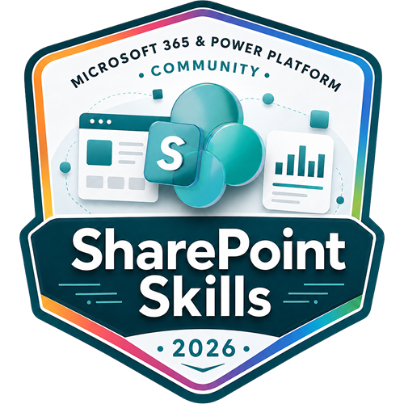

# SharePoint Skills

A curated library of AI skills for the latest AI features in Microsoft 365 SharePoint.

> **Status:** Active — new content added regularly.

---

## What's Inside

| Folder | Purpose |
|---|---|
| [`Skills/`](./Skills/) | AI skills — each skill in its own folder, ready to install into a SharePoint agent |

---

## Prerequisites

- Microsoft 365 tenant with **Copilot license**
- SharePoint contributor permissions (to add/upload a skill, but only reader needed to consume)

---

## Contributing

Contributions and corrections are welcome!

1. Fork the repo and create a branch: `git checkout -b skill/your-skill-name`
1. Add your skill folder under `Skills/<skill-name>/` and put runtime skill files in `Skills/<skill-name>/<skill-name>/` (upload-ready package)
1. Follow the full contribution standards in [Skills/README.md](./Skills/README.md#creating-a-skill) — covers required files, naming conventions, category guidance, file templates (including `sample.json`), and a pre-submission checklist
1. Open a pull request with a short description of what the skill does

All contributors on this repository will be acknowledged with special [SharePoint Skills Credly badge](https://www.credly.com/org/m365pnp/badge/sharepoint-skills-microsoft-365-power-platform-comm).

Notice that you'll need to register to this the community contribution program once if you have not done that yet. See more from our [Community Recognition Program](https://aka.ms/community/recognition).

---

## License

[MIT](./LICENSE) © 2026 [pnp](https://github.com/pnp)

---

## Disclaimer

These skills are provided as-is for learning and experimentation. They are not official Microsoft documentation. Always verify against the latest [Microsoft Learn](https://learn.microsoft.com) docs before deploying to production.
