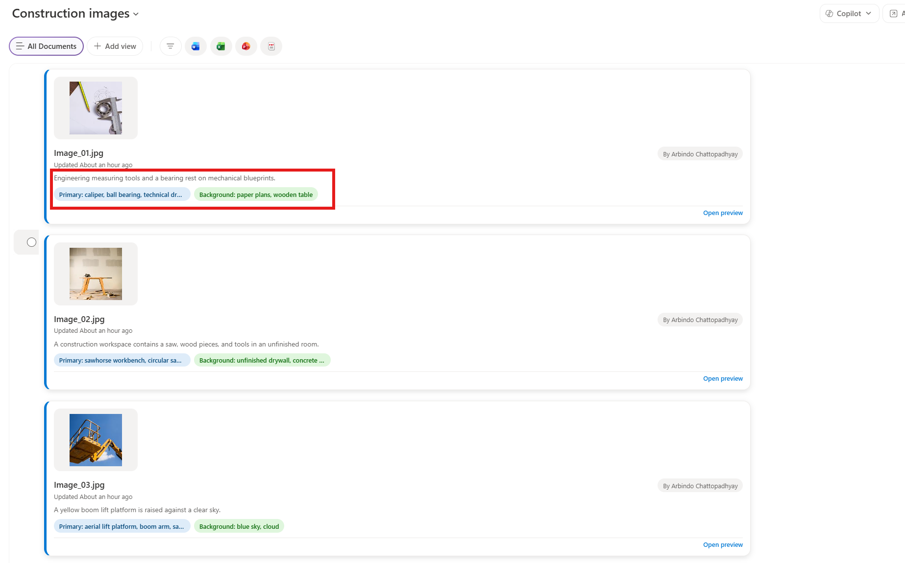

# Custom Image Tagger

A simple Copilot-in-SharePoint Skill that analyzes a selected images, extracts primary and background objects, and writes those values back into a SharePoint document library's metadata columns.

## What this repo contains
- **Skill definition:** [Skill.md](custom-image-tagger/Skill.md) — the skill manifest and instructions used by Copilot in SharePoint.
- **Demo script:** [Demo Script](demo/readme.md) — step-by-step demo prompts and the SharePoint demo link.
- **Article / background:** [Blogpost on Substack](https://www.thebecomingfrontier.com/p/your-image-library-is-full-of-information?r=2buxes) — long-form writeup and rationale.
- **Sample images:** [Sample Images](demo/sample-files/)

## Purpose
Make images in a SharePoint library searchable by content rather than filename by automatically populating the `Primary Objects` and `Background Objects` columns with comma-delimited object lists produced by image analysis.

## Usage
1. Open the target SharePoint document library and select one or more image files.
2. Invoke the skill by using natural-language trigger phrases described in [Skill.md](Skill.md) (for example: "Tag these images").
3. The skill will:
   - Extract a single-line, comma-delimited list of primary objects.
   - Extract a single-line, comma-delimited list of background objects.
   - Update the file's `Primary Objects` and `Background Objects` columns.
   - If the columns do not exist, the skill will create them.
4. Refer the sample-files in the demo folder for sample reference images for testing purposes.
5. Now users can search for images based on the tags extracted in the primary objects and background objects - use the search bar to search by objects inside the images
6. Images can also be reasoned over by Copilot. Use Copilot to find images - "show me images with wooden table"

## Output format
- Primary: a single line like `workbench, circular saw, tape measure`
- Background: a single line like `wall, drywall patches, floor`

## Demo
Follow the steps in [Demo Script](demo/readme.md) to try the skill in the SharePoint demo site referenced there.

## Notes
- The skill is designed to fail loudly: if image analysis returns empty or an update fails, the skill will report the failure rather than invent tags.
- For context and narrative on why this helps, see [Blogpost on Substack](https://www.thebecomingfrontier.com/p/your-image-library-is-full-of-information?r=2buxes).

## SharePoint Skill

| Solution | Author(s) |
| --- | --- |
| custom-image-tagger | Arbindo Chattopadhyay (Microsoft) &#124; [LinkedIn](https://www.linkedin.com/in/arbindoc)  |

## Version history

| Version | Date | Comments |
| --- | --- | --- |
| 1.0 | Jun 2026 | Initial Release |

## Disclaimer

**THIS CODE IS PROVIDED _AS IS_ WITHOUT WARRANTY OF ANY KIND, EITHER EXPRESS OR IMPLIED, INCLUDING ANY IMPLIED WARRANTIES OF FITNESS FOR A PARTICULAR PURPOSE, MERCHANTABILITY, OR NON-INFRINGEMENT.**

